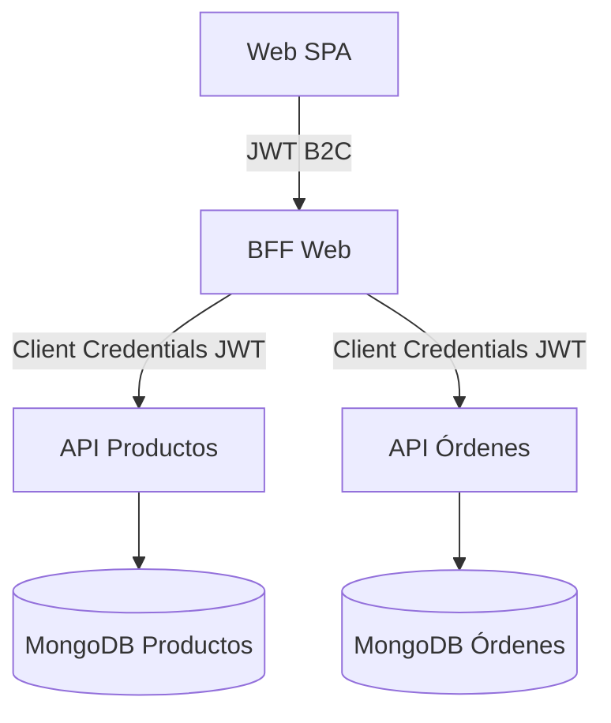

# ShopNest - Práctico: Implementación de un BFF Web

## 1. Objetivo General
Se entregan DOS APIs backend ya operativas (Productos y Órdenes) con sus bases de datos MongoDB pobladas. El objetivo del alumno es construir UN Backend For Frontend (BFF Web) orientado a una aplicación SPA de escritorio/navegador.

El BFF debe consumir ambas APIs y exponer una interfaz optimizada para el frontend Web. Debe implementar dos flujos de autenticación:
- B2C (User / End-User) entre el Frontend y el BFF usando Auth0 (SPA + PKCE).
- B2B (Service-to-Service) entre el BFF y las APIs de backend usando Client Credentials (Auth0 Machine to Machine) con scopes específicos.

## 2. Escenario de Negocio (Dominio)
ShopNest es un ecommerce simplificado. Los usuarios finales necesitan:
- Listar y buscar productos.
- Ver detalle de un producto.
- Crear una orden de compra.
- Consultar sus órdenes previas.

El canal Web prioriza riqueza de información (descripciones extensas, imágenes múltiples). (Mobile se descarta para este práctico.)

## 3. APIs Backend Provistas (NO modificar)
Se asume que ya existen dos servicios (se proveerán endpoints reales en el entorno de práctica):

### API Productos
- `GET /api/productos` -> Retorna lista completa con campos: `id, nombre, descripcionLarga, descripcionCorta, precio, imagenes[], stock, categoria, updatedAt`.
- `GET /api/productos/:id`

### API Órdenes
- `GET /api/ordenes?userId=...` -> Lista de órdenes del usuario.
- `GET /api/ordenes/:id`
- `POST /api/ordenes` -> Body: `{ userId, items: [{ productId, cantidad }], direccionEnvio }`.

### Autenticación de las APIs
Las APIs validan tokens emitidos para una aplicación M2M (client credentials) con scopes:
- `read:products`
- `read:orders`
- `write:orders`

Los alumnos NO agregan lógica ni endpoints a estas APIs; sólo las consumen desde los BFF.

## 4. BFF a Construir (Web)

### 4.1 BFF Web
- Se recomienda GraphQL para mostrar composición, selección de campos y futura extensibilidad.
- Debe exponer queries/mutations alineadas a las necesidades del frontend web.
- Debe proveer campos “ricos”: descripciones largas, varias imágenes, categoría completa, stock actual.

### 4.2 Comportamientos Requeridos
1. Capa de mapeo y adaptación de datos (DTOs / transformers entre APIs y schema GraphQL).
2. Manejo de errores normalizado (ej: `{ code, message, correlationId }`).
3. Logging de cada request con `requestId` (header `x-request-id` o UUID nuevo).
4. Timeouts y reintentos limitados a las APIs backend (ej: 3s timeout, hasta 2 reintentos exponenciales).
5. Cache in-memory opcional para listado de productos (TTL configurable) — justificar si se implementa o descarta.

## 5. Alcance Específico del BFF Web
| Aspecto | Definición |
|---------|------------|
| Protocolo sugerido | GraphQL (aceptable REST si se documenta justificación) |
| Campos producto (lista) | Todos los necesarios: nombre, precio, descripcionCorta, imagen principal + extras opcionales |
| Compresión | Activar gzip/br (si el runtime lo soporta fácilmente) |
| Caching | Opcional (TTL corto 30–60s para listados) |
| Seguridad | B2C JWT usuario final validado en gateway del BFF |
| Optimización red | Selección de campos via GraphQL o endpoints específicos |

## 6. Autenticación y Autorización (Auth0)

### 6.1 Flujo B2C (Frontend Web → BFF)
- SPA (Auth0 SPA + PKCE) -> Access Token para audiencia = BFF Web.
- El BFF valida firma (JWKS), issuer, audiencia y extrae `sub` como `userId`.

### 6.2 Flujo B2B (BFF → APIs Backend)
- BFF solicita token client credentials a Auth0 para audiencia = APIs backend.
- Credenciales (client_id / client_secret) en variables de entorno.
- Renovación anticipada si el token expira en <60s.

### 6.3 Scopes y Claims
- Scopes mínimos: `read:products`, `read:orders`, `write:orders` (para POST de órdenes).
- Validar presencia de scopes antes de invocar cada API (defensa extra).

### 6.4 Configuración Sugerida (.env ejemplo)
```env
AUTH0_DOMAIN=dev-XXXX.us.auth0.com
AUTH0_AUDIENCE_WEB_BFF=https://shopnest-bff-web
AUTH0_AUDIENCE_BACKEND=https://shopnest-core-apis
AUTH0_CLIENT_ID_M2M=...
AUTH0_CLIENT_SECRET_M2M=...
TOKEN_CACHE_TTL_SECONDS=600
PRODUCTS_API_BASE=https://.../api/productos
ORDERS_API_BASE=https://.../api/ordenes
```

## 7. Requerimientos Funcionales (BFF Web)

### 7.1 Queries (GraphQL sugerido)
- `products(page, pageSize, filter)`
- `product(id)`
- `ordersByUser(userId)` (userId derivado del token si coincide)

### 7.2 Mutations
- `createOrder(input)`

### 7.3 Validaciones
- `createOrder` valida existencia de cada `productId` (llamadas paralelas o batch) antes de enviar a API Órdenes.
- Payloads mal formados → 400 / GraphQL Validation Error uniforme.

## 8. Requerimientos No Funcionales
- TypeScript obligatorio.
- Linter + Prettier.
- Tests mínimos (1 unit test + 1 integración por BFF) – puede ser Jest / Supertest.
- Timeout outbound (ej: 3s) y reintentos (2) documentados.
- Logs estructurados JSON: nivel info / error.
- Manejo de variables centralizado (`config` module o patrón).

## 9. Arquitectura (Vista General)


## 10. Estrategia de Caching (Opcional)
- Cache por clave: `products:list:{hashFiltros}` en memoria.
- TTL sugerido: 30–60s.
- Considerar servir respuesta stale si backend temporalmente falla (explicar decisión en README del BFF).

## 11. Manejo de Errores
Formato estándar:
```json
{ "code": "UPSTREAM_TIMEOUT", "message": "Productos API timeout", "correlationId": "..." }
```
Mapeo sugerido:
- 400 → `BAD_REQUEST`
- 401/403 → `UNAUTHORIZED` / `FORBIDDEN`
- 404 → `NOT_FOUND`
- 5xx upstream → `UPSTREAM_ERROR`
- Timeout → `UPSTREAM_TIMEOUT`

## 12. Estrategia de Observabilidad (mínima)
- Log cada request entrante (método, ruta, userId, requestId, latency).
- Log de salida a APIs (url, status, duration, intento, éxito/fallo).
- Correlación por `requestId` propagado en headers internos `x-request-id`.

## 13. Scripts Sugeridos (package.json)
```json
{
	"scripts": {
		"dev": "ts-node-dev --respawn src/main.ts",
		"build": "tsc -p .",
		"start": "node dist/main.js",
		"lint": "eslint . --ext .ts",
		"test": "jest"
	}
}
```

## 15. Entregables del Alumno
1. Carpeta `bff-web` con código, `README` propio y scripts.
2. Diagrama actualizado si hubo variaciones arquitectónicas.
3. Archivo `REQUEST_COLLECTION.postman.json` (o similar) o consultas GraphQL para pruebas.
4. Instrucciones claras para correr el BFF localmente (`.env.example`).

## 16. Pasos de Inicio Rápido (Guía Sugerida)
1. Clonar repo base (con este enunciado).
2. Crear carpeta `bff-web`.
3. Configurar Auth0: aplicación SPA y M2M; definir audiences y scopes.
4. Implementar cliente de tokens M2M reutilizable (caché en memoria).
5. Crear capa HTTP con timeout y reintentos.
6. Implementar schema GraphQL inicial (`products`).
7. Agregar autenticación B2C (middleware / guard) y autorización por scope.
8. Añadir creación de órdenes (`createOrder`).
9. Agregar logs y formato de errores.
10. (Opcional) Cache.
11. Tests mínimos.
12. Documentar.

## 17. Ejemplo de Módulo de Token M2M (Esbozo)
```ts
// tokenClient.ts
import axios from 'axios';
let cached: { token:string; exp:number } | null = null;
export async function getM2MToken() {
	const now = Math.floor(Date.now()/1000);
	if (cached && cached.exp - 60 > now) return cached.token;
	const res = await axios.post(`https://${process.env.AUTH0_DOMAIN}/oauth/token`, {
		grant_type: 'client_credentials',
		client_id: process.env.AUTH0_CLIENT_ID_M2M,
		client_secret: process.env.AUTH0_CLIENT_SECRET_M2M,
		audience: process.env.AUTH0_AUDIENCE_BACKEND
	});
	cached = { token: res.data.access_token, exp: now + res.data.expires_in };
	return cached.token;
}
```

## 18. Consideraciones de Seguridad
- Nunca loggear tokens completos.
- Validar algoritmo y issuer del JWT B2C.
- Limitar origenes CORS apropiados.
- Tratar tiempos de expiración y rechazar tokens caducados.

## 19. Checklist Final Alumno
| Ítem | Listo |
|------|-------|
| BFF Web corre | ☐ |
| Auth0 B2C validado | ☐ |
| Auth0 B2B tokens funcionando | ☐ |
| Productos list / detalle | ☐ |
| Órdenes list / create | ☐ |
| Manejo de errores uniforme | ☐ |


